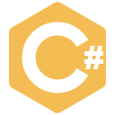

i try to build cool stuff
<h3> Python</h3>
 - ☆  An LLM benchmarking framework for GeoGuessr & geolocation.
 - ☆  An LLM benchmarking framework for OSINT tasks.
 - ☆  CLI tool that converts Obsidian notes to Anki flashcards automatically using an LLM.
 -  CLI tool to animate chronogeographic point data. Used to create historical Google Street View visualizations.
 -  Tool to obtain detailed metadata from Google Street View locations.
 -  A Discord bot to play GeoGuessr in Discord with friends.
 -  Autonomous framework using browser automation to allow large language models to play GeoGuessr.
 -  Implements AlphaZero-style reinforcement learning to train a Yu-Gi-Oh! agent. Includes a vectorized C++ environment, Python bindings for ygopro-core, state serialization, replay adapters, a pluggable agent framework, evolutionary deckbuiling, a game TUI, and more.
 -  Summarize Git commits/PRs with Claude Code or Gemini CLI
 -  Anki plugin for voice-to-voice feedback from flashcards
 - [%3A)](https://github.com/ccmdi) A simple RAG system in Discord for answering questions about GeoGuessr using a knowledge base and semantic search.

<h3> Typescript</h3>
 -  A TypeScript SDK for managing Claude Code instances.
 -  Wordle for frontend, with AI orchestration for question generation.
 -  A Claude-controlled reverse proxy.

 -  Schema enforcement for Obsidian properties.
 -  A performant and customizable map inside Obsidian Bases.
 -  Obsidian vault broadcasting; push and pull subsets of your vault to and from remote sources.
 -  Reusable widgets plugin for Obsidian.
 -  A plugin for Obsidian that automatically formats pasted links with metadata, with explicit support for YouTube.
 -  Bulk replace text tool for Obsidian

<h3> C#</h3>
 -  A visual configuration editor for Vali, a map generation tool, with JSON schema validation and expression autocomplete.
 -  Reverse engineered Yu-Gi-Oh Master Duel's effect system to allow LLMs to interface with the engine and play autonomously.

 -  Flow Launcher plugin for searching Firefox tabs.
 -  Flow Launcher plugin for searching local codebases.

<h3> React</h3>
 - ☆  A portfolio designed from my Obsidian PKMS.
 - ☆  A dashboard to manage Claude Code instances, with syncback to each task's "source of truth".
 -  A collection of beautiful chess games.

<h3> Nextjs</h3>
 - ☆  A web application that helps open-source contributors find repositories using a scoring algorithm.
 - ☆  Wikipedia for GeoGuessr
 - ☆  A social media aggregator and management app for all platforms.

<h3> Rust</h3>
 -  Natural language to shell commands, instantly (via Groq)
 -  Native messaging host for Firefox tabs over TCP.

<h3> C</h3>
 -  Tool to find the longest possible chess puzzle from a given starting position

---
*<small>Generated from [ccmdi.com](https://ccmdi.com)</small>*
